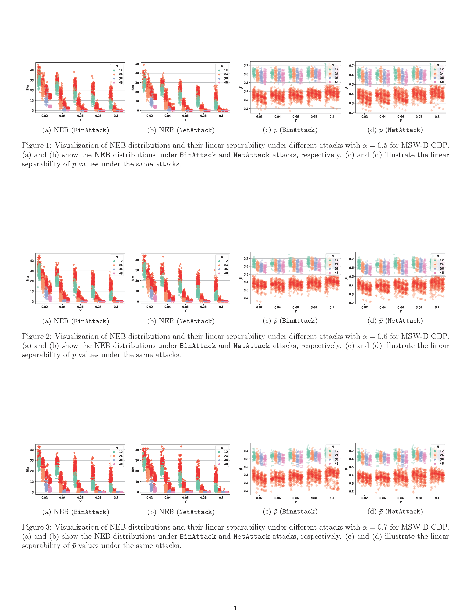
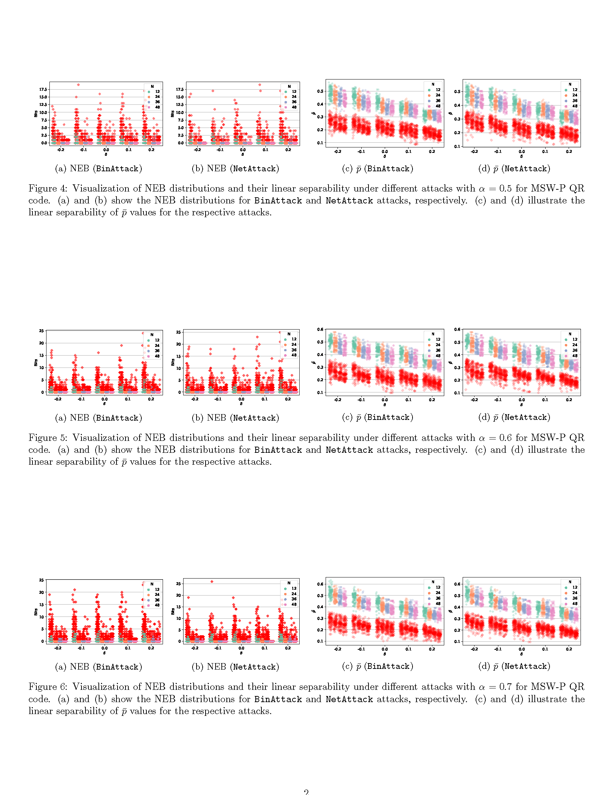

<h1>Mixed-Bit Sampling Watermarking: Unifying Stochastic Anti-Counterfeiting and Authentication in Copy Sensitive Graphical Codes</h1>

Jiale Chen1,3, Li Dong1, and Wei Wang2,3, Weiwei Sun4, Yushu Zhang5, Jiantao Zhou6

1Ningbo University,
2Shenzhen MSU-BIT University,
3Beijing Institute of Technology,
4Alibaba Group,
5Jiangxi University of Finance and Economics,
6University of Macau

# Introduction
1. This is the official implementation of the paper titled *"Mixed-Bit Sampling Watermarking: Unifying Stochastic Anti-Counterfeiting and Authentication in Copy Sensitive Graphical Codes."*
2. The work is based on our preliminary research [MSG](https://ieeexplore.ieee.org/document/10376267), and more details of the preliminary work can be found at [GitHub Repository](https://github.com/chenoly/MSG).
3. The dataset used in this work is publicly available at [Kaggle](https://www.kaggle.com/datasets/chenoly/msw-dataset).

## Overview
The problem of counterfeiting poses serious consequences. Copy Sensitive Graphical Codes (CSGC) refers to a generic type of image pattern that is highly sensitive to physical illegal copying, and Copy Detection Patterns (CDP) and Two-Level QR Codes (2LQR code) are the two representative solutions. However, CDP implements the anti-copying by generating random noise, but it cannot convey any watermarks for authentication. In contrast, 2LQR code provides watermarking function by modulating pre-defined deterministic texture patterns, but it lacks stochasticity to resist illegal copying.

In this work, we propose a unified optimization framework, which enjoys the stochastic anti-counterfeiting of CDP and the watermarking functionality of 2LQR code. Specifically, we treat CDP as random noise image that is composed of multiple texture patterns like the texture pattern in 2LQR code, each pattern representing one bit. To this end, both CDP and 2LQR codes can be obtained by designing how to generate the texture patterns.

We formulate the generation of texture patterns into a constrained optimization framework termed Mixed-Bit Sampling Watermark (MSW) for texture pattern generation. The objective function consists of the white pixel ratio and spatial randomness of texture patterns, and the constraints are the watermark embedding function which can be flexibly selected by users (e.g., DCT watermark or Pearson similarity). A two-step sampling algorithm is proposed to solve this optimization problem.

We demonstrate two concrete examples of the MSW framework and compare them with the conventional CDP and 2LQR code. Experimental results demonstrate that the texture patterns generated by the proposed MSW method can effectively address issues in both CDP and 2LQR code.
## Supplementary experimental results

## Requirements
- Python
- bchlib==0.14.0
- opencv-python==3.4.2.16
- numpy
- scikit-image
- scipy
- hashlib
- pytorch
